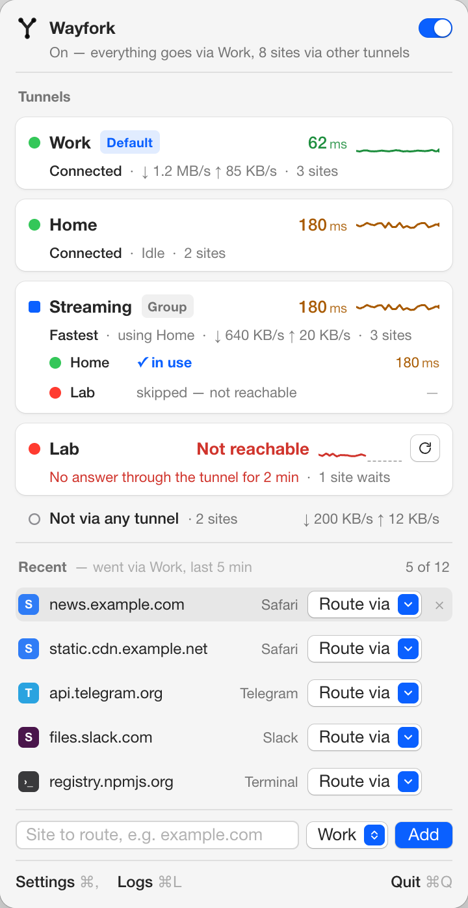
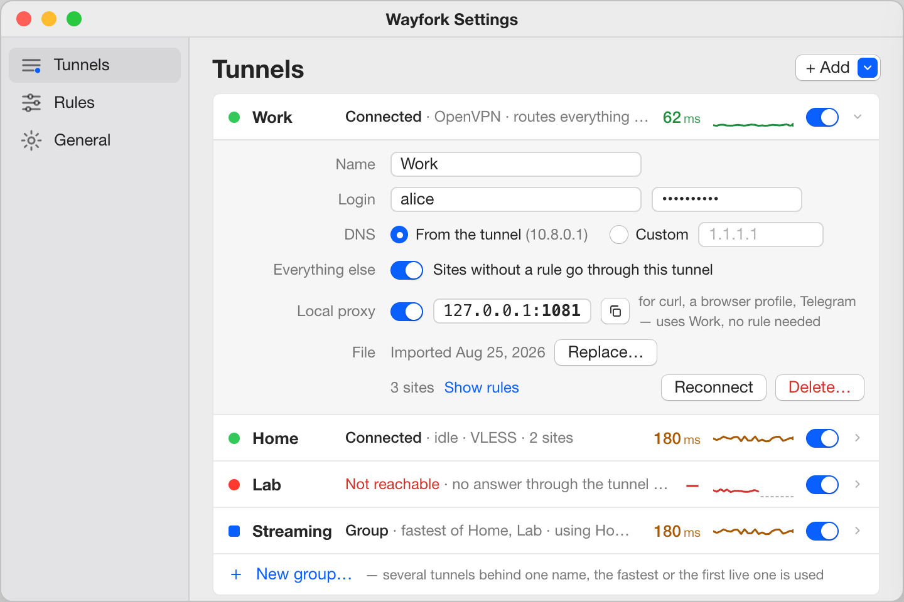
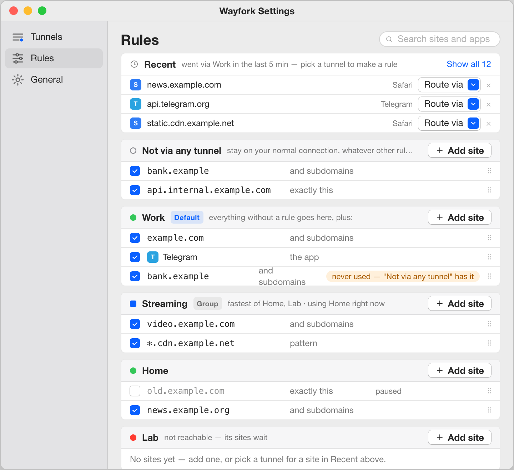

# Wayfork

macOS menu bar app for per-domain split tunneling across several VPNs at once. Add your
tunnels (OpenVPN `.ovpn`, VLESS `vless://`), write rules like "`*.example.com` → Work",
"Telegram → Home" or "`10.8.0.0/24` → Office", pick which tunnel takes everything else — or
none. All tunnels stay up simultaneously; there is no switching.



## Features

- **Tunnels**: OpenVPN profiles (inline certs, username/password asked once) and VLESS URIs
  (TCP, WebSocket, gRPC; TLS and REALITY). Enable, disable, rename, reconnect. Secrets go to
  the Keychain, never to disk.
- **Rules**: `domain → tunnel`, first match wins. Exact (`api.example.com`), suffix
  (`example.com` covers subdomains) and wildcard (`*.cdn.example.com`) patterns. Quick add
  straight from the menu bar.
- **Application rules**: route an app (every process inside its bundle) through a tunnel
  or keep it direct, whatever it talks to.
- **IP rules**: an IPv4 address or subnet instead of a domain — SSH/RDP/DB by IP, an office
  network behind OpenVPN, an internal server without a name.
- **Default tunnel**: route everything not matched by a rule through one tunnel. Without
  one, unmatched traffic goes direct.
- **Exceptions**: rules that target *Direct*. They win over everything, so they carve
  domains, apps or ranges out of the default tunnel or out of a broader rule. `.local`,
  `.lan`, `.internal`, `.home.arpa` are always direct.
- **Live edits**: changing rules while On is a hot reload; changing a tunnel reconnects only
  that tunnel.
- **Status and traffic**: menu bar icon (off / connecting / on / degraded / error), a card
  per enabled tunnel with its state, rule count and live download / upload rate, a Direct
  row for what bypasses the tunnels; hover for session totals.
- **Logs and diagnostics**: one window for the app, sing-box and per-tunnel OpenVPN logs;
  "Export Diagnostics" zips logs and a sanitized config for bug reports.
- **Settings**: launch at login, connect on launch, auto-reconnect with backoff, resolver
  for direct traffic (system / custom), log level and retention, JSON export/import of
  tunnels and rules (with or without secrets).

What comes next is in [docs/ROADMAP.md](docs/ROADMAP.md); changes per version in
[CHANGELOG.md](CHANGELOG.md).

## Install

Requires macOS 14 (Sonoma) or later, Apple silicon or Intel.

1. Download `Wayfork-<version>.dmg` from the
   [Releases](https://github.com/fosteev/Wayfork/releases) page (the `.sha256` next to it
   is for `shasum -a 256 -c`).
2. Open the image and drag **Wayfork** to **Applications**. The app is signed with a
   Developer ID and notarized, so Gatekeeper opens it without ceremony.
3. Launch Wayfork. It lives in the menu bar; there is no Dock icon.

Building from source is described under [Development](#development).

### First run

Click the menu bar icon and flip the switch. Wayfork registers a small privileged helper;
macOS asks you to approve it once in *System Settings › General › Login Items &
Extensions* under *Allow in the Background*. There is no password prompt — the helper is
what starts `sing-box` and `openvpn` for you. Once approved, Turn On brings every enabled
tunnel and the routing engine up; Turn Off restores networking as it was.

If another VPN client is running (especially one that also owns the default route or a
system proxy), stop it first — two products fighting over the default route is the most
common reason for "routing engine failed to start".

## Tunnels



- **OpenVPN**: *Settings › Tunnels › + Add › OpenVPN…* or drop a `.ovpn` onto the window.
  Profiles with inline `<ca>`/`<cert>`/`<key>` blocks work as they are; if the profile needs
  a username/password you are asked once. `up`/`down` scripts are never executed. Routes
  pushed by the server are ignored (`--route-nopull`) — Wayfork decides what goes where.
- **VLESS**: *+ Add › VLESS…* and paste a `vless://` URI (the sheet shows what was parsed).
  REALITY is supported over TCP; XHTTP is not (see the roadmap).
- Turn on *Route everything else through this tunnel* to make it the default exit. If that
  tunnel goes down, unmatched traffic is blocked rather than leaked.

## Rules



| Pattern | Matches |
|---|---|
| `api.example.com` | that host only |
| `example.com` | the host and every subdomain |
| `*.cdn.example.com` | one label under `cdn.example.com` |
| `/Applications/Telegram.app` (via *+ › Application…*) | every process of that bundle |
| `203.0.113.7`, `10.8.0.0/24` | connections opened to that address / subnet |

Rules are grouped by tunnel; the *Direct* group holds exceptions and always comes first.
Inside a group, domain, application and IP rules are peers. A rule that can never fire
(shadowed by an earlier one, or pointing at a disabled tunnel) gets a warning chip, and so
does an IP rule that covers your own LAN. Quick add in the popover: type a domain or an
IP, pick a tunnel or *Direct*.

A few things worth knowing:

- Domain rules decide by the name a connection was opened with, so a site reached by name
  follows its domain rule even when the name resolves into a range covered by an IP rule.
  IP rules catch clients that connect by address or resolve names on their own.
- Private ranges (`10/8`, `172.16/12`, `192.168/16`, `100.64/10`) stay out of Wayfork
  entirely unless a tunnel rule names a subnet inside them — that is how an OpenVPN office
  network becomes reachable.
- Application rules see the process that opens the connection: an app that talks through
  another local proxy is seen as that proxy, not as the app. The rule stays in place (flagged
  "not found") if the app is removed.

## How it works

- [sing-box](https://github.com/SagerNet/sing-box) owns a TUN interface and the default
  route, answers DNS with fake IPs so every connection is routed by domain, and hosts the
  VLESS outbounds.
- Each OpenVPN profile runs as its own `openvpn --route-nopull` process on its own `utun`;
  sing-box reaches it through an interface-bound outbound.
- A launchd daemon (`WayforkDaemon`, registered with `SMAppService`) is the only privileged
  part: it spawns the bundled binaries, adds routes, samples traffic counters and streams
  logs to the app over XPC. The app itself is unprivileged and keeps `store.json` and the
  Keychain.
- Everything is bundled: `sing-box` and a static `openvpn` (pinned in
  `scripts/versions.env`). No kernel extensions, no Network Extension.

Files: `~/Library/Application Support/Wayfork/store.json` (tunnels, rules, settings — no
secrets), `~/Library/Logs/Wayfork/` (app and mirrored runtime logs),
`/Library/Application Support/Wayfork/run/` and `/Library/Logs/Wayfork/` (daemon, root-only).

## Troubleshooting

- **"Helper requires approval"** — open *System Settings › General › Login Items &
  Extensions* and enable Wayfork under *Allow in the Background*, then Turn On again.
- **Helper out of date after an update** — *Settings › General › Reinstall helper*
  re-registers the daemon from the current bundle (`Can't reach the Wayfork helper` offers
  the same button).
- **"Routing engine failed to start"** — another VPN or proxy is holding the default route
  or the TUN address range. Stop it and Turn On again; *Logs › sing-box* shows what sing-box
  complained about.
- **A domain does not go where expected** — check the rule's warning chip (shadowed /
  tunnel disabled), then `dig +short <domain>`: while On, matched domains resolve to
  `198.18.x.x`–`198.19.x.x` fake IPs. Browsers with their own DNS-over-HTTPS bypass
  Wayfork's DNS — turn off "secure DNS" in the browser or point it at the system resolver.
  A system-wide HTTP/SOCKS proxy (an `HTTP_PROXY` variable, a proxy in *System Settings ›
  Network*) also bypasses the TUN for the apps that honour it.
- **Rates show `—`** — the app has not heard from the helper for 3 s; if it stays that way
  while traffic flows, *Logs* will show `traffic: clash api unreachable`.
- **Tunnel failed** — the card shows the reason (bad credentials, key passphrase, config
  error); the pencil jumps to the field to fix. Everything else is in *Logs* (⌘L).
- **Bug report** — *Settings › General › Export Diagnostics* produces a zip with secrets
  stripped.

## Limitations (0.1)

- **IPv4 only while On**: the TUN has no IPv6 address and DNS returns no AAAA records, so
  IPv6-only destinations are unreachable until you Turn Off. IPv6 rules come with IPv6
  support.
- **Browser DoH bypasses domain rules**: a browser that resolves names over DNS-over-HTTPS
  never asks Wayfork's resolver, so its traffic is seen by IP only — disable secure DNS or
  use IP / application rules for it.
- **No kill switch**: a matched domain whose tunnel is down fails to connect rather than
  leaking, and a default tunnel that is down blocks unmatched traffic, but there is no global
  "block everything when a tunnel drops".
- **Application rules** only see traffic that enters the TUN; a process talking through a
  local proxy is matched as the proxy. Rules are by bundle path — a moved app needs a new rule.
- **IP rules** are IPv4 and match by destination address only; no port or protocol
  conditions.
- No rule lists or subscriptions, no WireGuard / Shadowsocks / XHTTP yet — see the roadmap.

## Development

Xcode 26 is required (Swift 6 language mode, strict concurrency).

```sh
scripts/fetch-bins.sh            # download pinned sing-box, build static openvpn (universal)
scripts/dev-sign.sh              # build signed with your Apple Development identity
swift test --package-path Wayfork/WayforkCore
scripts/format.sh --lint         # swift-format check (scripts/format.sh to fix)
scripts/release.sh --skip-notarize   # archive + sign + DMG smoke test (any identity)
```

`Wayfork/Wayfork.xcodeproj` holds the `Wayfork` app and `WayforkDaemon` targets;
`Wayfork/WayforkCore` is a local Swift package shared by both. Plain `xcodebuild` and
Xcode's Run produce ad-hoc signed builds that work for UI work but cannot register the
privileged helper — use `scripts/dev-sign.sh` for that, then copy the app to
`/Applications` (the app re-registers the helper when the bundle changes). Pinned versions
live in `scripts/versions.env`; bundled binaries go to `Wayfork/Resources/bin/`
(git-ignored). Design notes are in [docs/design/](docs/design/), the UI prototype the
screenshots come from is
[docs/design/prototype/variant-b.html](docs/design/prototype/variant-b.html).

### Releasing

`scripts/release.sh` archives the app, signs everything (app, daemon, bundled binaries)
with a *Developer ID Application* identity — hardened runtime, secure timestamps —
notarizes it with `notarytool`, staples the ticket and produces a signed, notarized
`build/release/Wayfork-<version>.dmg` with a `.sha256`. It needs the identity in the
keychain and a notarytool credentials profile
(`xcrun notarytool store-credentials <name> …`), passed as `--identity` /
`--keychain-profile` or `WAYFORK_RELEASE_IDENTITY` / `WAYFORK_NOTARY_PROFILE`. Bump
`MARKETING_VERSION` and `CURRENT_PROJECT_VERSION` in the project, update `CHANGELOG.md`,
run the script, tag `v<version>` and attach the DMG to the GitHub release.

## License

TBD
