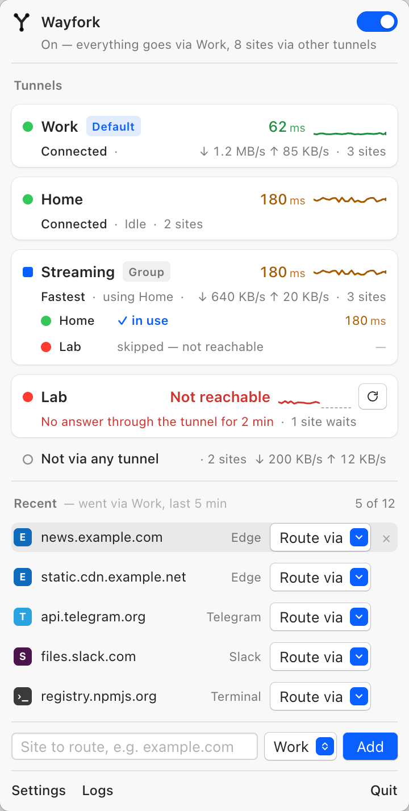
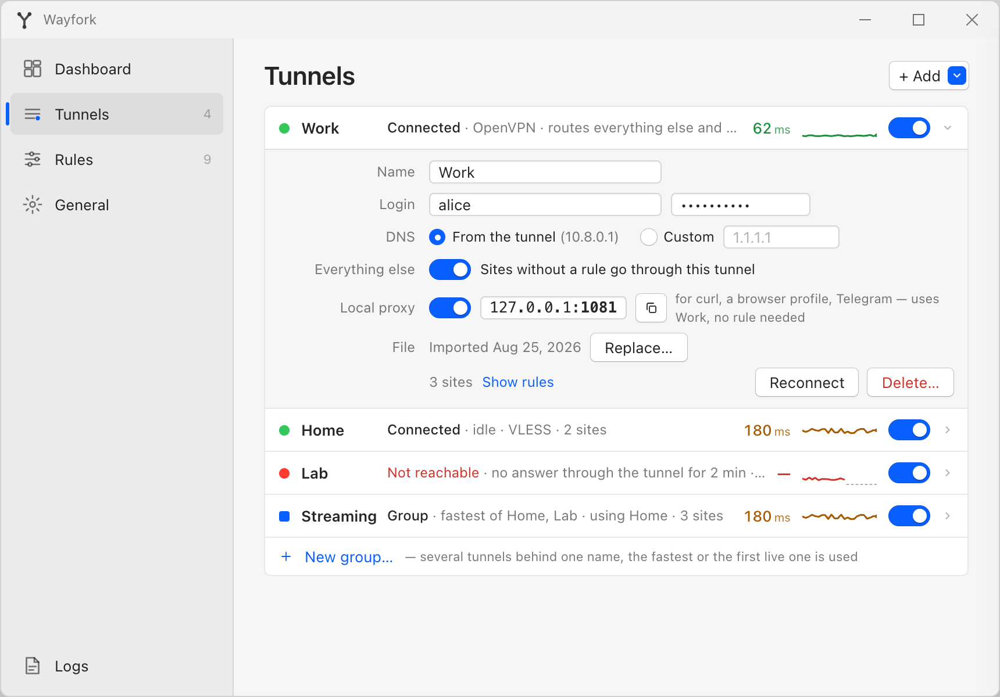
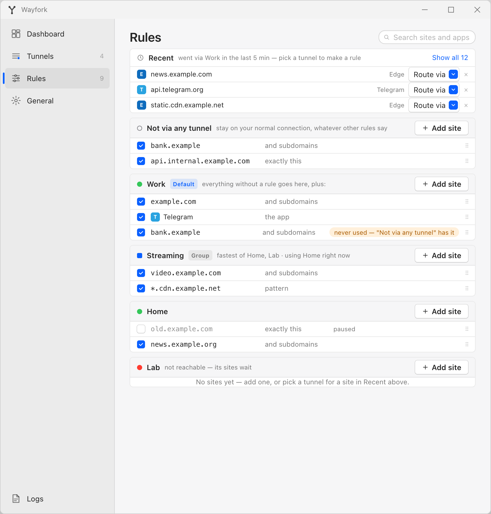

# Wayfork

[](#macos)
[](#windows)
[](#tunnels)
[](#tunnels)
[](https://github.com/fosteev/Wayfork/releases)

**Per-domain split tunneling across several VPNs at once.** Add your tunnels (OpenVPN
`.ovpn`, VLESS `vless://`), write rules like `*.example.com → Work`, `Telegram → Home`,
`10.8.0.0/24 → Office`, and pick which tunnel takes everything else — or none. All tunnels
stay up simultaneously; there is no switching.

Native on both platforms: a **menu bar app on macOS**, a **notification-area app on
Windows**, one repository, one rule model, one export format.

| macOS — menu bar | Windows — system tray |
|---|---|
|  |  |

## Features

- **Tunnels** — OpenVPN profiles (inline certs, credentials asked once) and VLESS URIs
  (TCP, WebSocket, gRPC; TLS and REALITY). Secrets go to the Keychain (macOS) or DPAPI
  (Windows), never to disk in the clear.
- **Rules** — `domain → tunnel`, first match wins. Exact (`api.example.com`), suffix
  (`example.com` covers subdomains), wildcard (`*.cdn.example.com`).
- **Application rules** — route an app, and every process inside it, through a tunnel or
  keep it direct, whatever it talks to.
- **IP rules** — an IPv4 address or subnet instead of a domain: SSH/RDP/DB by IP, an office
  network behind OpenVPN, an internal server with no name.
- **Default tunnel** — everything unmatched through one tunnel; without one it goes direct.
  If that tunnel drops, unmatched traffic is blocked rather than leaked.
- **Exceptions** — rules that target *Direct*. They win over everything, carving domains,
  apps or ranges out of the default tunnel. `.local`, `.lan`, `.internal`, `.home.arpa`
  are always direct.
- **Live edits** — a rule change is a hot reload; a tunnel change reconnects that tunnel only.
- **Status and traffic** — tray/menu bar icon (off · connecting · on · degraded · error),
  a card per tunnel with state, rule count and live down/up rate, plus a Direct row.
- **Logs and diagnostics** — app, sing-box and per-tunnel OpenVPN logs in one window;
  "Export Diagnostics" zips them with a sanitized config.
- **Settings** — launch at login, connect on launch, auto-reconnect with backoff, Wayfork
  as the system resolver while On, resolver for direct traffic, log level and retention,
  JSON export/import (with or without secrets) that moves a setup between macOS and Windows.

Roadmap: [docs/ROADMAP.md](docs/ROADMAP.md) · [docs/ROADMAP-windows.md](docs/ROADMAP-windows.md).
Changes per version: [CHANGELOG.md](CHANGELOG.md).

## Install

Both platforms are built from the same [release](https://github.com/fosteev/Wayfork/releases);
each artefact ships a `.sha256` next to it.

### macOS

Requires macOS 14 (Sonoma) or later, Apple silicon or Intel.

1. Download `Wayfork-<version>.dmg`, verify with
   `shasum -a 256 -c Wayfork-<version>.dmg.sha256`, drag **Wayfork** to **Applications**.
2. Clear the quarantine flag — the 0.2 builds are signed with an Apple *Development*
   certificate but **not notarized**, so Gatekeeper refuses a downloaded copy:

   ```sh
   xattr -dr com.apple.quarantine /Applications/Wayfork.app
   ```

   Use `-r`: it also covers the privileged helper and the bundled `sing-box` / `openvpn`.
3. Launch it. Wayfork lives in the menu bar, with no Dock icon. Flip the switch; macOS asks
   you once to approve the helper in *System Settings › General › Login Items & Extensions*
   under *Allow in the Background*. There is no password prompt.

Notarization needs a paid Apple Developer Program membership the project does not have yet.
The signature is real (`codesign --verify --deep --strict` passes); only the download check
is missing. To avoid trusting a binary Apple cannot vouch for, build it yourself — a free
Apple ID is enough, see [Development](#development).

### Windows

Requires Windows 10 21H2 or Windows 11, x64 or ARM64.

1. Download `Wayfork-<version>.exe` — it carries both architectures and installs the right
   one. (`Wayfork-<version>-amd64.msi` / `-arm64.msi` are there for MSI-based deployment;
   `$env:PROCESSOR_ARCHITECTURE` says which.) Verify with `Get-FileHash`.
2. Run it. The 0.2 builds are **unsigned** — no Authenticode certificate yet — so
   SmartScreen shows "Windows protected your PC": *More info* → *Run anyway*. The same
   warning appears on the first launch.
3. The installer puts Wayfork in `%ProgramFiles%\Wayfork`, registers the **Wayfork** service
   (LocalSystem, delayed auto-start) and installs the bundled `ovpn-dco` adapter driver —
   WHQL-signed by OpenVPN Inc., no prompt and no reboot. A machine that already has OpenVPN
   keeps its own copy of the driver.
4. Start **Wayfork** from the Start menu. It lives in the notification area; flip the
   switch — no UAC prompt, the service is already there.

If the app reports the service as missing or mismatched, repair the install: *Settings ›
Apps › Installed apps › Wayfork › Modify → Repair*. Uninstalling removes the service, the
`Wayfork-N` adapters, the driver package Wayfork published (never one belonging to an
OpenVPN install), the DNS rule and `%ProgramData%\Wayfork\run`; logs, tunnels and rules
under `%LOCALAPPDATA%\Wayfork` are kept.

> Running another VPN client at the same time — especially one that also owns the default
> route or a system proxy — is the most common cause of "routing engine failed to start".
> Stop it first.

## Tunnels

| macOS | Windows |
|---|---|
|  |  |

- **OpenVPN** — *+ Add › OpenVPN…*, or drop a `.ovpn` onto the window. Inline
  `<ca>`/`<cert>`/`<key>` blocks work as they are; a profile that needs a username/password
  asks once. `up`/`down` scripts are never executed, and routes pushed by the server are
  ignored (`--route-nopull`) — Wayfork decides what goes where.
- **VLESS** — *+ Add › VLESS…* and paste a `vless://` URI; the sheet shows what was parsed.
  REALITY over TCP is supported, XHTTP is not (see the roadmap).
- *Route everything else through this tunnel* makes it the default exit.

## Rules

| macOS | Windows |
|---|---|
|  |  |

| Pattern | Matches |
|---|---|
| `api.example.com` | that host only |
| `example.com` | the host and every subdomain |
| `*.cdn.example.com` | one label under `cdn.example.com` |
| `/Applications/Telegram.app`, `C:\…\Telegram.exe` (via *+ › Application…*) | every process of that app |
| `203.0.113.7`, `10.8.0.0/24` | connections opened to that address / subnet |

Rules are grouped by tunnel; the *Direct* group holds exceptions and always comes first.
On Windows, *+ › Application…* lists the applications that are running, so an app is picked
by name; *Browse…* there points at an `.exe` that is not started.
Inside a group, domain, application and IP rules are peers. A rule that can never fire —
shadowed by an earlier one, or pointing at a disabled tunnel — gets a warning chip, and so
does an IP rule covering your own LAN.

Worth knowing:

- Domain rules decide by the name a connection was opened with, so a site reached by name
  follows its domain rule even when it resolves into a range covered by an IP rule. IP
  rules catch clients that connect by address or resolve names on their own.
- Private ranges (`10/8`, `172.16/12`, `192.168/16`, `100.64/10`) stay out of Wayfork unless
  a tunnel rule names a subnet inside them — that is how an OpenVPN office network becomes
  reachable.
- Application rules see the process that opens the connection: an app talking through
  another local proxy is seen as that proxy.

## How it works

- [sing-box](https://github.com/SagerNet/sing-box) owns a TUN interface and the default
  route, answers DNS with fake IPs so every connection is routed by domain, and hosts the
  VLESS outbounds.
- Each OpenVPN profile runs as its own `openvpn --route-nopull` process on its own
  interface (`utun` on macOS, an `ovpn-dco` `Wayfork-N` adapter on Windows); sing-box
  reaches it through an interface-bound outbound.
- One privileged component does the rest: a launchd daemon registered with `SMAppService`
  on macOS, a LocalSystem service on Windows. It spawns the bundled binaries, adds routes,
  samples traffic counters and streams logs to the unprivileged GUI.
- Everything is bundled — `sing-box` and `openvpn`, pinned in `scripts/versions.env` and
  `WayforkWindows/versions.env`. No kernel extension and no Network Extension on macOS; on
  Windows the only driver installed is OpenVPN's WHQL-signed `ovpn-dco` (sing-box's TUN
  rides the wintun sing-tun already embeds).

| | macOS | Windows |
|---|---|---|
| GUI | SwiftUI menu bar app | Flutter + `fluent_ui`, notification area |
| Privileged half | `WayforkDaemon` (launchd, `SMAppService`), XPC | Go service (LocalSystem), named pipe |
| Config, rules | `~/Library/Application Support/Wayfork/store.json` | `%LOCALAPPDATA%\Wayfork\store.json` |
| Secrets | Keychain | DPAPI (`secrets.dat`) |
| Logs | `~/Library/Logs/Wayfork/` | `%LOCALAPPDATA%\Wayfork\logs\` |
| Package | signed `.dmg` | `.exe` bundle of two `.msi` |

## Troubleshooting

- **"Helper requires approval"** (macOS) — *System Settings › General › Login Items &
  Extensions*, enable Wayfork under *Allow in the Background*, Turn On again.
- **Helper/service out of date** — *Settings › General › Reinstall helper* on macOS;
  *Modify → Repair* in Installed apps on Windows.
- **"Routing engine failed to start"** — another VPN or proxy holds the default route or the
  TUN address range. Stop it, then Turn On; *Logs › sing-box* shows what it complained about.
- **A domain does not go where expected** — check the rule's warning chip, then resolve it
  (`dig +short <domain>` / `Resolve-DnsName <domain>`): while On, matched domains answer
  with `198.18.x.x`–`198.19.x.x` fake IPs. Browsers with their own DNS-over-HTTPS bypass
  Wayfork's resolver — turn off "secure DNS" or point it at the system resolver. A
  system-wide HTTP/SOCKS proxy bypasses the TUN too, for the apps that honour it.
- **Rates show `—`** — the GUI has not heard from the privileged half for 3 s; if traffic is
  flowing, *Logs* will show `traffic: clash api unreachable`.
- **Tunnel failed** — the card carries the reason (bad credentials, key passphrase, config
  error) and the pencil jumps to the field to fix.
- **Bug report** — *Settings › General › Export Diagnostics* produces a zip with secrets
  stripped.

## Limitations (0.2)

- **IPv4 only while On** — the TUN has no IPv6 address and DNS returns no AAAA records, so
  IPv6-only destinations are unreachable until you Turn Off. IPv6 rules come with IPv6 support.
- **Browser DoH bypasses domain rules** — a browser resolving over DNS-over-HTTPS never asks
  Wayfork, so its traffic is seen by IP only. Disable secure DNS, or use IP/application rules.
- **Wayfork owns the DNS setting while On** — an entry you made yourself is restored when
  Off, and editing it while On is undone on the spot. If Wayfork was removed while On and
  macOS still points at `172.19.0.2`, run `networksetup -setdnsservers Wi-Fi empty`.
- **No kill switch** — a tunnel that is down fails its matched connections rather than
  leaking them, but there is no global "block everything when a tunnel drops".
- **Application rules** only see traffic entering the TUN, and are keyed by path — a moved
  app needs a new rule. They do not cross platforms in an export.
- **IP rules** are IPv4 and match the destination address only; no port or protocol conditions.
- No rule lists or subscriptions, no WireGuard / Shadowsocks / XHTTP yet.
- Neither build is signed for its store: macOS is not notarized, Windows is not Authenticode-signed.

## Development

### macOS — Xcode 26 (Swift 6 language mode, strict concurrency)

```sh
scripts/fetch-bins.sh                 # pinned sing-box, static universal openvpn
scripts/dev-sign.sh                   # build signed with your Apple Development identity
swift test --package-path Wayfork/WayforkCore
scripts/format.sh --lint              # swift-format check (drop --lint to fix)
```

`Wayfork/Wayfork.xcodeproj` holds the `Wayfork` and `WayforkDaemon` targets;
`Wayfork/WayforkCore` is a local Swift package shared by both. Plain `xcodebuild` and
Xcode's Run produce ad-hoc signed builds — fine for UI work, but they cannot register the
privileged helper; use `scripts/dev-sign.sh` and copy the app to `/Applications`. The script
needs an *Apple Development* identity: sign in to Xcode with any Apple ID (*Settings ›
Accounts*, no paid membership) and it creates one for your personal team. Builds made this
way are trusted on your own Mac, no quarantine step needed.

### Windows — toolchains pinned in `WayforkWindows/versions.env`

```powershell
scripts\fetch-win-bins.ps1 -Arch amd64   # pinned sing-box, OpenVPN, the ovpn-dco package
cd WayforkWindows\app;     flutter test; dart analyze --fatal-infos
cd WayforkWindows\service; go test ./...; go vet ./...
scripts\release-windows.ps1              # both MSIs and the bundle → build\release-windows\
```

`WayforkWindows/app` is the Flutter app, `WayforkWindows/service` the Go service
(`internal/core` is the pure, everywhere-tested half; Win32 stays behind `//go:build
windows`, so `go test ./...` passes on macOS too) and `WayforkWindows/installer` the WiX
source of the MSI.

### Shared

`fixtures/` holds the test inputs and golden outputs used by the Swift, Dart and Go tests
alike. Design notes live in [docs/design/](docs/design/) — Windows deltas in
[08-windows.md](docs/design/08-windows.md) — and the screenshots above come from the UI
prototypes, [variant-b.html](docs/design/prototype/variant-b.html) and
[windows.html](docs/design/prototype/windows.html). Release steps:
[docs/RELEASING.md](docs/RELEASING.md).

## License

TBD
